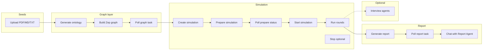

# MiroFish workflow

This document describes the typical order of operations when using MiroFish: from uploading seed documents to generating a prediction report and optionally chatting with agents.

## Pipeline overview

## Step-by-step (recommended order)

1. **Configure environment**  
   Copy `.env.example` to `.env` and set `LLM_API_KEY`, `LLM_BASE_URL`, `LLM_MODEL_NAME`, and `ZEP_API_KEY`. Start the stack (`npm run dev`) so the backend is on port `5001` (or your `FLASK_PORT`).

2. **Upload seeds and generate ontology**  
   `POST /api/graph/ontology/generate` with multipart form: one or more files (`files`) and a required natural-language `simulation_requirement`. Optional: `project_name`, `additional_context`.  
   **Result:** `project_id` (`proj_xxx`), ontology (entity/edge types), and stored extracted text.

3. **Build the knowledge graph (Zep)**  
   `POST /api/graph/build` with JSON `{"project_id": "proj_xxx", ...}`.  
   **Result:** `task_id` for the async build.

4. **Wait for graph build**  
   Poll `GET /api/graph/task/<task_id>` until status is completed (or check project state via `GET /api/graph/project/<project_id>`). On success, the project has a `graph_id`.

5. **Create a simulation**  
   `POST /api/simulation/create` with `{"project_id": "proj_xxx"}`. Optional: `graph_id`, `enable_twitter`, `enable_reddit`.  
   **Result:** `simulation_id` (`sim_xxx`).

6. **Prepare the simulation**  
   `POST /api/simulation/prepare` with `{"simulation_id": "sim_xxx"}`. This reads entities from Zep, generates OASIS agent profiles and `simulation_config.json` (LLM-heavy).  
   **Result:** `task_id` (unless already prepared).

7. **Wait for preparation**  
   Poll `POST /api/simulation/prepare/status` with JSON `{"task_id": "task_xxx"}` and/or `simulation_id` until the simulation is ready.

8. **Start the simulation**  
   `POST /api/simulation/start` with `{"simulation_id": "sim_xxx", "platform": "parallel"}` (or `twitter` / `reddit`). Optional: `max_rounds` to cap length, `enable_graph_memory_update`, `force` to restart.  
   **Cost note:** Long runs consume many LLM calls; the README suggests trying fewer than ~40 rounds first.

9. **Monitor run (optional)**  
   `GET /api/simulation/<sim_xxx>/run-status` for progress; `GET .../run-status/detail` or `GET .../actions` for activity.

10. **Stop the simulation (optional)**  
    `POST /api/simulation/stop` with `simulation_id` if you need to halt before natural completion.

11. **Generate the report**  
    `POST /api/report/generate` with `{"simulation_id": "sim_xxx"}`.  
    **Result:** `task_id` and `report_id`.

12. **Wait for report generation**  
    Poll `POST /api/report/generate/status` with `task_id` or `simulation_id` until completed. You can also poll `GET /api/report/<report_xxx>/progress` or `GET .../sections` for streaming-style progress.

13. **Read or download the report**  
    `GET /api/report/<report_xxx>` or `GET /api/report/by-simulation/<sim_xxx>`; `GET .../download` for Markdown.

14. **Chat with the Report Agent**  
    `POST /api/report/chat` with `simulation_id` and `message` (optional `chat_history`). Uses tools against the graph and simulation context.

## Optional: agent interview

After the simulation process is in a state where the environment can accept commands (see API docs for `env-status` and interview requirements):

- `POST /api/simulation/interview` — single agent  
- `POST /api/simulation/interview/batch` — multiple agents  
- `POST /api/simulation/interview/all` — same question to all agents  

Interview endpoints require the simulation environment to be alive (`POST /api/simulation/env-status`). If the run has finished, behavior depends on how the runner left the environment; see [API.md](./API.md).

## Related reading

- [CONFIGURATION.md](./CONFIGURATION.md) — tuning knobs and limits  
- [API.md](./API.md) — full endpoint list with examples  
